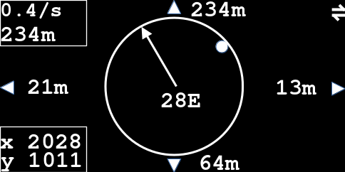

# Description

This is the main game. It compiles by default with I2C communication enabled.

If the *Map* I2C client is not available, the display will show *NACK 
(Address)* for five seconds and after that the game can be played without the 
*Map* application. No more attempts are made to establish I2C communication.

## Compiling

Use [ArduinoIDE](https://www.arduino.cc/en/software) or 
[arduino-cli](https://arduino.github.io/arduino-cli/1.0/).

## Gameplay

In order to use the *Map* application via I2C with this game. You must

1. Load the *Map* application on the other Arduboy.

2. Connect the other Ardudoy to the Arduboy with Ardymo installed with an I2C
   cable. (QWIIC).

3. Start the *Map* application on the other Arduboy **before** starting the
   *Ardymo* application, so as to allow *Ardymo* to find the *Map* client on
   the I2C bus.

### Objective

The player is an AI driving a vehicle and has to rely exclusively on the sensor
values to reach the target. The objective is to reach the target without
crashing into obstacles or into the target. The run is successful if the
vehicle gets within 5m of the target at zero speed.

If the player crashes into an obstacle the vehicle is replaced at the starting
position. The coordinates of the crash are displayed. If the player crashes
into the target, the target is destroyed and the game is lost.

**NB:** The game is a lot less interesting when the player is looking at the
map during the gameplay. The map allows a spectator to follow the progress
of the player.

### Screen

The sensor values available are:
1. The distances to the nearest obstacle to the left, the right, rearward and 
   in front of the vehicle.

2. The distance to the target: the box in the top left corner.

3. The direction of the target with respect to the vehicle axis: the dot on the
   circle in the center of the screen.

4. The north with respect to the vehicle axis: the line inside the circle.
   hea

5. The heading of the vehicle with respect to the north: the number in degrees
   inside the circle.

6. The coordinates of the vehicle in the lower left corner.

### Movement

The vehicle is accelerated forward with the UP button and rearward with the
DOWN button. The vehicle turns left or right around the midpoint of its rear 
side by 2 degrees when the LEFT or RIGHT buttons are pressed respectively.

### Controls

| Key    | Action                                  |
|--------|-----------------------------------------|
| UP     | Accelerate forward, next menu item      |
| DOWN   | Accelerate rearward, previous menu item |
| LEFT   | Turn left, previous option in menu item |
| RIGHT  | Turn right, next option in menu item    |
| B      | Open/Close Menu                         |
| A      | Menu select                             |

